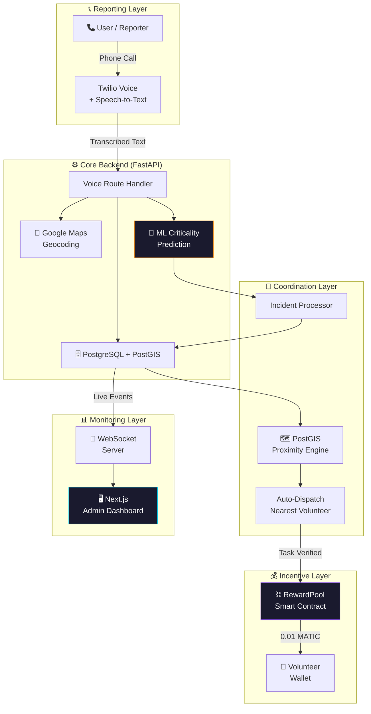

<p align="center">
  
  <br/>
  
  
  
  
  
  
</p>

# 🚨 SmartAccident

> **Voice-Powered Real-Time Accident Reporting, AI-Prioritized Response, and Blockchain-Incentivized Volunteer Coordination**

SmartAccident is a full-stack emergency management platform where anyone can **call a phone number** to report an accident. The system uses **AI** to assess severity, **geospatial intelligence** to dispatch the nearest volunteer, a **real-time dashboard** for live monitoring, and **blockchain smart contracts** to reward verified responders with cryptocurrency.

---

## ⚡ How It Works (30-Second Summary)

```
📞 User calls Twilio number → 🗣️ Describes accident in speech
      ↓
🧠 AI classifies severity (ML model, 99.6% F1)
      ↓
📍 Geocodes location → 🗺️ PostGIS finds nearest volunteer
      ↓
📊 Live dashboard updates via WebSocket
      ↓
✅ Volunteer verifies → 💰 Blockchain sends MATIC reward
```

---

## 🏗️ System Architecture



---

## 🎯 Key Features

| Feature | Description |
|---------|-------------|
| **🗣️ Voice Reporting** | Call a phone number → describe accident in natural speech → system handles everything |
| **🧠 AI Severity Assessment** | TF-IDF + GradientBoosting classifies incidents as *Moderate* or *Highly Critical* (99.6% F1) |
| **📍 Geospatial Dispatch** | PostGIS `ST_Distance` finds and assigns the nearest available volunteer automatically |
| **📊 Real-Time Dashboard** | Next.js 16 glassmorphism UI with live WebSocket updates, interactive Leaflet maps |
| **⛓️ Blockchain Rewards** | Solidity RewardPool contract on Polygon Amoy distributes 0.01 MATIC per verified task |
| **🔌 WebSocket Events** | `new_accident`, `volunteer_dispatched`, `task_updated` — instant UI updates |
| **🔒 Double-Payout Prevention** | Smart contract prevents re-rewarding the same task (on-chain guard) |

---

## 🛠️ Technology Stack

| Layer | Technology | Why |
|-------|-----------|-----|
| **Telephony** | Twilio Voice API | Natural-language accident reporting via phone calls |
| **Backend** | FastAPI (async) | High-perf async Python with auto-generated OpenAPI docs |
| **Database** | PostgreSQL + PostGIS | Geospatial-enabled relational DB for proximity matching |
| **ML Model** | scikit-learn (TF-IDF + GradientBoosting) | Real-time criticality classification |
| **Geocoding** | Google Maps API | Address-to-coordinate conversion |
| **Real-time** | FastAPI WebSockets | Live dashboard push updates |
| **Frontend** | Next.js 16 + Framer Motion + SWR | SSR dashboard with glassmorphism dark-mode UI |
| **Maps** | Leaflet.js | Interactive accident visualization |
| **Blockchain** | Solidity + Hardhat + Polygon Amoy | Trustless volunteer reward distribution |
| **Backend ↔ Chain** | Web3.py | Python ↔ smart contract interaction |
| **Infrastructure** | Docker Compose | One-command PostgreSQL + PostGIS setup |

---

## 📂 Repository Structure

```
HackByte4.0/
├── backend/                        # FastAPI Backend
│   ├── src/
│   │   ├── config/                 # Settings + async DB engine
│   │   ├── models/                 # SQLAlchemy ORM (Accident, Volunteer, Task)
│   │   ├── schemas/                # Pydantic v2 request/response schemas
│   │   ├── routes/                 # REST endpoints + Twilio TwiML handlers
│   │   ├── services/               # Business logic
│   │   │   ├── twilio_voice.py     #   Voice TwiML generation
│   │   │   ├── geocoding.py        #   Google Maps geocoding
│   │   │   ├── ml_predictor.py     #   ML criticality prediction
│   │   │   ├── dispatch.py         #   PostGIS proximity dispatch
│   │   │   ├── blockchain.py       #   Web3.py ↔ RewardPool contract
│   │   │   └── websocket.py        #   ConnectionManager for live events
│   │   └── utils/                  # PostGIS ↔ LatLng converters
│   ├── alembic/                    # Database migrations
│   └── requirements.txt            # Python dependencies (51 packages)
│
├── frontend/                       # Next.js 16 Admin Dashboard
│   └── src/
│       ├── app/                    # Pages: /, /accidents, /map, /tasks, /volunteers
│       ├── components/             # WebSocketProvider, MapComponent, Navbar, Sidebar
│       └── lib/api.ts              # API client + TypeScript types
│
├── blockchain/                     # Solidity Smart Contracts
│   ├── contracts/RewardPool.sol    # Volunteer reward pool (OpenZeppelin)
│   ├── scripts/deploy.js           # Deployment script (Polygon Amoy)
│   ├── test/RewardPool.test.js     # 8 passing tests
│   └── hardhat.config.js           # Hardhat config (Amoy testnet)
│
├── ml-model/                       # ML Model Training
│   ├── train.py                    # TF-IDF + GradientBoosting trainer
│   ├── training_data.csv           # 600 synthetic samples
│   └── model_metadata.json         # Performance metrics
│
├── docker-compose.yml              # PostgreSQL + PostGIS + Backend + Frontend
└── .env.example                    # Environment variable template
```

---

## 📡 API Endpoints (21 total)

| Method | Endpoint | Description |
|--------|----------|-------------|
| `GET` | `/health` | Health check |
| | **Voice Pipeline (Twilio)** | |
| `POST` | `/api/v1/voice/incoming` | Handle incoming call → greet → ask location |
| `POST` | `/api/v1/voice/location` | Process spoken location → ask for details |
| `POST` | `/api/v1/voice/report` | Full pipeline: geocode → ML → store → dispatch → TwiML |
| `POST` | `/api/v1/voice/status` | Twilio call status callback |
| | **Accidents** | |
| `GET` | `/api/v1/accidents/` | List accidents (paginated, filterable) |
| `POST` | `/api/v1/accidents/` | Create accident manually |
| `GET/PATCH/DELETE` | `/api/v1/accidents/{id}` | CRUD operations |
| | **Volunteers** | |
| `GET` | `/api/v1/volunteers/` | List volunteers (with `available_only` filter) |
| `POST` | `/api/v1/volunteers/` | Register volunteer |
| `GET/PATCH/DELETE` | `/api/v1/volunteers/{id}` | CRUD operations |
| | **Tasks** | |
| `GET` | `/api/v1/tasks/` | List dispatch tasks (with `status_filter`) |
| `POST` | `/api/v1/tasks/` | Create task assignment |
| `GET/PATCH/DELETE` | `/api/v1/tasks/{id}` | CRUD + **auto-reward on verification** |
| `GET` | `/api/v1/tasks/pool-info` | Blockchain reward pool stats |
| | **Real-time** | |
| `WS` | `/ws` | WebSocket for live event streaming |

---

## 🚀 Quick Start

### Prerequisites

- **Python 3.12+** with `pip`
- **Node.js 20+** with `pnpm`
- **Docker** (for PostgreSQL + PostGIS)
- Twilio account *(optional — can simulate calls with curl)*

### 1. Clone & Configure

```bash
git clone https://github.com/Auxilus08/HackByte4.0.git
cd HackByte4.0
cp .env.example .env
# Edit .env with your credentials (see Environment Variables below)
```

### 2. Start the Database

```bash
docker compose up db -d
```

### 3. Setup Backend

```bash
cd backend
python3 -m venv venv
source venv/bin/activate
pip install -r requirements.txt
alembic upgrade head
cd ..
```

### 4. Train the ML Model

```bash
python ml-model/train.py
```

### 5. Start the Backend

```bash
cd backend
uvicorn src.main:app --host 0.0.0.0 --port 8000 --reload
```

### 6. Start the Frontend

```bash
cd frontend
pnpm install
pnpm dev
```

### 7. Open the Dashboard

Navigate to **http://localhost:3000** 🎉

---

### 🔗 Blockchain Setup (Optional)

```bash
cd blockchain
pnpm install
npx hardhat compile
npx hardhat test                              # Run 8 contract tests
npx hardhat run scripts/deploy.js --network amoy  # Deploy to Polygon Amoy
```

After deployment, update `.env` with the contract address:
```env
REWARD_CONTRACT_ADDRESS=0xYourDeployedAddress
```

---

## 🧪 Testing the Full Pipeline (No Twilio Needed)

```bash
# 1. Register a volunteer
curl -X POST http://localhost:8000/api/v1/volunteers/ \
  -H "Content-Type: application/json" \
  -d '{"name":"Rahul Sharma","phone":"+919876543210","wallet_address":"0xABC...","location":{"lat":21.15,"lng":79.09}}'

# 2. Simulate a voice call (full pipeline)
curl -X POST "http://localhost:8000/api/v1/voice/report?location=NH44+near+Nagpur" \
  -d "SpeechResult=Major+truck+overturn+5+people+trapped+fire+spreading&Confidence=0.9&From=+919876543210"

# 3. Check the dashboard
open http://localhost:3000

# 4. Verify a task (triggers blockchain reward)
curl -X PATCH http://localhost:8000/api/v1/tasks/{TASK_ID} \
  -H "Content-Type: application/json" \
  -d '{"status":"verified"}'
```

### Real Phone Calls (with Twilio)

1. Get a Twilio phone number
2. Expose your server: `ngrok http 8000`
3. Set Twilio webhook URL to: `https://your-ngrok.ngrok.io/api/v1/voice/incoming`
4. Call your Twilio number — the full pipeline runs automatically!

---

## ⚙️ Environment Variables

| Variable | Required | Description |
|----------|----------|-------------|
| `DATABASE_URL` | ✅ | PostgreSQL connection string |
| `SECRET_KEY` | ✅ | Application secret key |
| `TWILIO_ACCOUNT_SID` | ❌ | Twilio account SID (for real calls) |
| `TWILIO_AUTH_TOKEN` | ❌ | Twilio auth token |
| `TWILIO_PHONE_NUMBER` | ❌ | Your Twilio phone number |
| `GOOGLE_MAPS_API_KEY` | ❌ | Google Maps Geocoding API key |
| `WEB3_PROVIDER_URL` | ❌ | Polygon RPC endpoint |
| `REWARD_CONTRACT_ADDRESS` | ❌ | Deployed RewardPool contract address |
| `DEPLOYER_PRIVATE_KEY` | ❌ | Contract owner's private key |

> **Note:** Only `DATABASE_URL` and `SECRET_KEY` are required. All other services fall back gracefully (simulation mode, rule-based ML, coordinate fallback).

---

## 🧠 ML Model Performance

| Metric | Score |
|--------|-------|
| **F1 Score** | 99.6% |
| **Algorithm** | TF-IDF (5000 features) + GradientBoosting |
| **Training Data** | 600 synthetic accident reports |
| **Classes** | `Moderate`, `Highly Critical` |
| **Fallback** | Rule-based keyword scoring when model unavailable |

---

## ⛓️ Smart Contract Details

| Property | Value |
|----------|-------|
| **Contract** | `RewardPool.sol` |
| **Network** | Polygon Amoy Testnet (Chain ID: 80002) |
| **Reward** | 0.01 MATIC per verified task |
| **Security** | OpenZeppelin `Ownable` + `ReentrancyGuard` |
| **Tests** | 8/8 passing (Hardhat) |
| **Features** | Double-payout prevention, per-volunteer earnings tracking, pool funding |

---

## 👥 Team

**HackByte 4.0** — Built with ❤️

---

## 📜 License

MIT License — see [LICENSE](LICENSE) for details.
